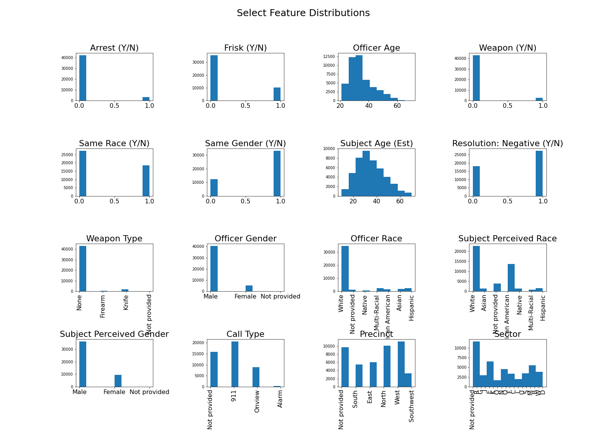
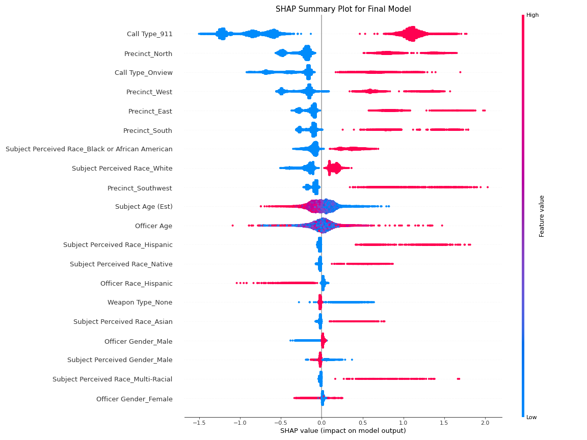

# Police Data Analysis: Terry Stops in Seattle

## Introduction
This analysis seeks to add understanding to data regarding police interactions known as Terry stops. According to [Merriam-Webster](https://www.merriam-webster.com/legal/Terry%20stop), a Terry stop is "a stop and limited search of a person for weapons justified by a police officer's reasonable conclusion that a crime is being or about to be committed by a person who may be armed and whose responses to questioning do not dispel the officer's fear of danger to the officer or to others." This type of interaction will be analyzed in depth.

More specifically, the analysis will create a model to predict whether an infraction will be added to a subject's record -- whether that is through an arrest, referral for prosecution, citation or offense report. A criminal record can have enormous impacts on an individual's life, and whether or not a subject gets let off or not have countless consequences, including employment, child custody, adoption, driving, firearms, immigration, punishment for subsequent crimes, financial aid for college admissions, and housing, among others [(1)](1). As a result of these lasting consequences, it can be valuable to understand patterns and potential biases within the way infractions are addressed within different demographics. The analysis explores topics such as race, gender, age, location, and more. 


**Repository Directory**

```
├── README.md        <-- Main README file explaining the project's purpose,
│                        methodology, and findings
│
├── data             <-- Data in CSV format
│   ├── processed    <-- Processed (combined, cleaned) data used for modeling
│   └── raw          <-- Original (immutable) data dump
│
├── images           <-- Figures used in presentation and notebooks
│
├── notebooks        <-- Jupyter Notebooks for exploration and presentation
│   └── exploratory  <-- Unpolished exploratory data analysis (EDA) notebooks
│
├── reports          <-- Generated analysis (including presentation.pdf)
│
└── src              <-- Python source code for custom functions used in project
```


## Data Sources & Preparation
#### Source
The city of Seattle [provides](https://data.seattle.gov/Public-Safety/Terry-Stops/28ny-9ts8) substantial publicly available data about these encounters. There are over 47,000 records spanning a period from 2015 to 2021. It includes 23 different features, including topics such as race, gender, age, location, call type, and the final resolution of the stop -- whether it ended in arrest or citation, for example.

#### Preparation
To begin, rudimentary cleaning of the data was necessary: correcting typos/inconsistencies, interpolating missing values, etc. Since some features were extermely granular, it was necessary to bin some features into larger categories to add statistical significance downstream. 

Beyond this cleaning, feature engineering included calculating the officer's age at time of Terry stop, as well as categorizing "negative" resolutions correctly to encompass outcomes that lead to lasting criminal records. 

Before beginning the modeling process, a train-test split was implemented, at which point the testing data wasn't viewed until after the final model had been selected.

## Data Understanding
To begin, a distributions of key features were investigated. They can be seen in the figure below. 



In addition to general distributions, select feature exploration can be seen below. 


## Modeling
Various different models were tested on the dataset to identify the best performer for the selected data. Beginning with Logistic Regression, the analysis advanced to K-Nearest Neighbors, Decision Trees, Random Forests, and finally XG Boost models. In each case, sklearn's GridSearchCV function was used to tune the model by testing a wide array of hyperparameters. In each case, cross-validation was implemented. 


## Evaluation
The below dataframe compares the results of the various above-mentioned models. 


After studying each option, it was determined that XG Boost was the strongest performing model on the desired F1 scale. As a result, it was selected for use on the test data. The corresponding confusion matrix can be seen below.


Using this model, a SHAP summary plot was created to show the importance and directionality of the most relevant features. It can be seen below. 





## Conclusion
The investigation brings about a valuable understanding of the most relevant indicators of negative outcomes of a Terry stop in the Seattle area. The below observations are determined by both the SHAP plot and exploratory data analysis that can be found in this project's Jupyter notebook.

The most valuable predictors of a negative outcome for a Terry stop are:
- Origin of the call, such as a 911 or an onview stop
- Police precinct where stop took place
- Subject perceived race

Take note that each of these factors is more impactful than intuitive indicators of what might lead to a negative outcome, include:
- Whether or not the subject has a weapon
- Officer gender


Other interesting trends include:
- A moderately predictive model can be created using *exclusively* racial data. If there were no systemic societal racial bias, the model would be inconclusive since individuals of all races would receive a negative resolution equally often. This is clearly not the case.
- Stops originating from a 911 call or onview stop are strong indicators of a negative outcome for the subject.
- As subject age increases, negative outcomes become less likely. 
- As officer age increases, negative outcomes become more likely.
- Subjects of the following races are strongly associated with more negative outcomes: Black or African American, Hispanic, Native (American Indian, Alaska Native, Native Hawaiian or Other Pacific Islander). White subjects are less frequently associated with negative outcomes.
- Stops by Hispanic officers are correlated with lower likelihood of a negative subject outcome. 


#### Further Investigation

Inevitably, this analysis leaves many valuable insights undiscovered. Further investigation could include areas such as:

- Detailed study of the "call type" feature. The dataset gives information about the reason that the stop was initiated, which could speculatively provide powerful insights and add substantial model accuracy. 
- More in-depth study of geographical importance. The dataset provides breakdowns based on district, etc. Although these features are directly used within the model, feature engineering could likely provide additional value.
- Comparison with city demographics. Although we have distributions based on race, we don't use metrics about race in the Seattle area at large. This could provide insight into how often stops are made of different races. Additionally, the call types broken down by race, age and gender would be an interesting topic to investigate further.
- Expanding the scope of the study dramatically, it could prove valuable to perform similar analysis on data from other cities that may make related datasets available. An understanding could be gathered about that area, but also the comparison with other areas could identify underlying geographical trends. 
